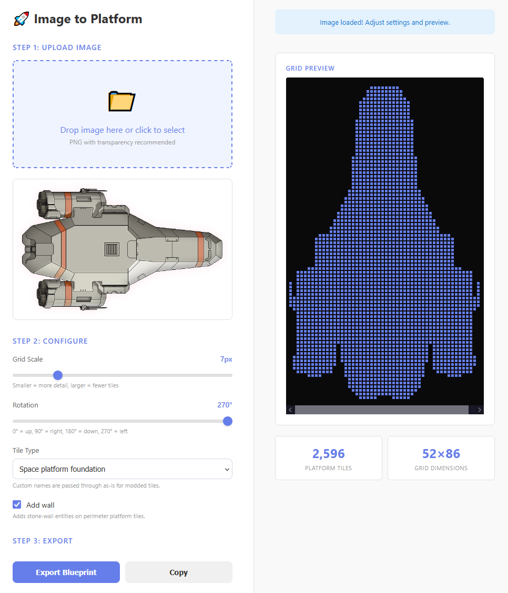

Takes an image (With transparency) and converts it into a blueprint.
Main use case was platforms, but you can choose other tiles for your use case.

## Social preview metadata

The page includes Open Graph and Twitter card tags in [index.html](index.html) so links render rich previews in Discord and other platforms.

If your deployment URL changes, update these values in [index.html](index.html):

- `link rel="canonical"`
- `meta property="og:url"`
- `meta property="og:image"`
- `meta name="twitter:image"`

Use absolute `https://` URLs for preview tags. After changes, re-scrape the URL in a social preview validator if old previews are cached.
